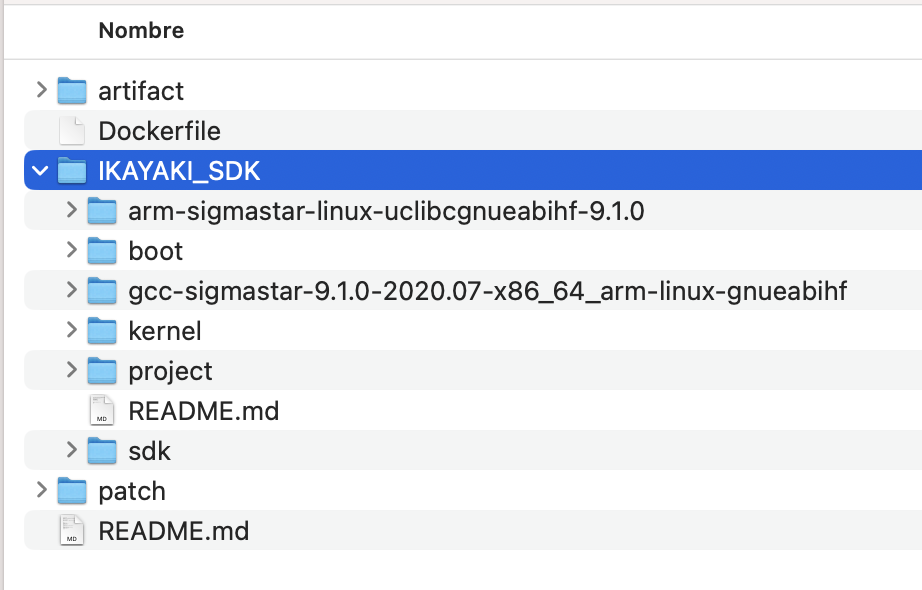

# DongshanPI PicoW Docker

## Prerequisites
Download [IKAYAKI_SDK.zip](https://dongshanpi.cowtransfer.com/s/5c3c05deef7247), extract it, and place each folder in the IKAYAKI_SDK **directory** of this project, resulting in a file structure as depicted in the following image.

<p align='center'>
<br />
</p>

## Build
```bash
docker build -t dongshanpi-ubuntu .
```

## Run interactive mode
```bash
docker run --name dongshanPI-ubuntu -iv ${PWD}/artifact:/artifact -it dongshanpi-ubuntu /bin/bash
```

## Compile
```bash
# Test
arm-linux-gnueabihf-gcc -v

# Compile boot
echo "[run] Compile boot"
cd /home/dongshanpi/IKAYAKI_SDK/boot/
make pioneer3_spinand_defconfig
make -j8
cp u-boot_spinand.xz.img.bin ../project/board/p3/boot/spinand/uboot/

# Compile kernel
echo "[run] Compile kernel"
cd /home/dongshanpi/IKAYAKI_SDK/kernel/
make -f _makefile pioneer3_ssc021a_s01a_spinand_demo_defconfig
make -j8

# Compile SDK
cd /home/dongshanpi/IKAYAKI_SDK/project/
make dispcam_p3_spinand.glibc-9.1.0-s01a.64.qfn68.demo_defconfig
make image
cp -a image/output/images/* /artifact
echo "[run] OK"
```
